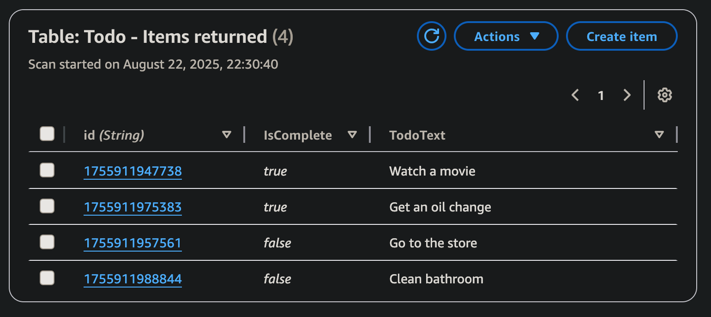

# todo-list-app

A simple app that uses DynamoDB and React to manage tasks. 

[Live website ](https://todo-list-dynamodb.vercel.app/)

## Project Setup

- Added IAM user with AmazonDynamoDBFullAccess policy.
- Used ```npm create vite@latest my-app -- --template react``` to create fresh React project 
- Ran ```npm install``` and ```npm run dev``` 
- Made ```.env.local``` file and added the security credentials (Access key ID & Secret access key).
- Installed SDK Packages ```npm install @aws-sdk/client-dynamodb @aws-sdk/lib-dynamodb```
- Made a components folder with a file named ```Dynamo.jsx```, and added template code to it
- Imported ```Dynamo``` from ```Dynamo.jsx``` to ```App.jsx```
- Ran ```npm run build```

## DynamoDB table


